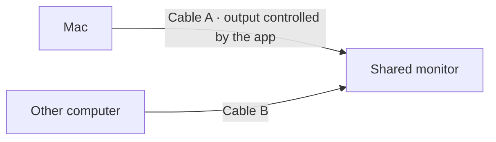

<p align="center"><a href="README.md">Español</a> · <strong>English</strong></p>

<p align="center">
  
</p>

<h1 align="center">Logical Unplug</h1>

<p align="center">One monitor, two computers. Switch computers without unplugging cables.</p>

<p align="center">
  <a href="https://github.com/alexsvt2/logical-monitor-unplug/releases/latest">Download for Mac</a> ·
  <a href="#how-to-use-it">How to use it</a> ·
  <a href="#if-your-monitor-is-missing">Recover displays</a>
</p>

Logical Unplug is a native macOS app that **disables and re-enables an external display through software**. Choose your monitor in the app and control it from the window or menu bar. There is no need to edit scripts, look up display identifiers, or install tools in Terminal.

## The use case

Your Mac has a primary display and a second monitor connected to **two computers through separate cables**. You want to use that second monitor with the other computer, but the Mac is still sending it video.

1. Disable the shared monitor on the Mac using Logical Unplug.
2. The monitor loses that signal. If it supports automatic input switching, it can switch to the cable connected to the other computer.
3. When you want to return, re-enable the display in the app. Depending on your monitor, you may need to select the Mac's input in the monitor's own menu.

The cables stay connected. The app controls the Mac's video output; **the monitor handles input switching**. The app does not control your keyboard, mouse, or other computer.



## The app

The v0.2.0 interface is in Spanish. This guide includes the Spanish button labels so you can find them in the app.

<p align="center">
  
</p>

- **Visual selection:** lists detected displays and remembers your choice, without hardcoded brands.
- **One button to toggle:** disables or re-enables the selected display.
- **Updated status:** checks macOS every two seconds.
- **Menu bar access:** control your display even after closing the window.
- **Manual recovery:** attempts to re-enable outputs that have disappeared from the list.
- **Primary display protection:** prevents disabling the primary or built-in display.

## Download and install

Release **v0.2.0** includes an app for **Apple Silicon Macs (M1 or later)**. Its minimum deployment target is macOS 13; local checks were performed on an M4 Mac running macOS 26. It has not been validated on every OS version or monitor.

1. Download `LogicalUnplug-v0.2.0-macOS-arm64.zip` from [Releases](https://github.com/alexsvt2/logical-monitor-unplug/releases/latest).
2. Unzip it and drag `LogicalUnplug.app` into **Applications**.
3. Open the app. You can also drag it to the Dock for quick access.

**No Homebrew, Python, or displayplacer installation is required.** The app includes its own native display controls.

This release is signed locally (*ad hoc*), without a Developer ID certificate or Apple notarization. If macOS blocks the first launch because it cannot verify the developer, see [Apple's instructions for opening an app from an unknown developer](https://support.apple.com/en-ca/guide/mac-help/mh40616/mac). You may need to authorize it under **System Settings → Privacy & Security → Open Anyway**.

## How to use it

1. Connect the monitor to your Mac and choose the display you want to share. If there is exactly one secondary external display, it is preselected.
2. Click **Desactivar en este Mac** (Disable on this Mac) to stop sending it video.
3. Click **Reactivar en este Mac** (Re-enable on this Mac) when you want to return.

The app remembers your selection automatically. When you replace a monitor, select the new one from the list. The app does not silently replace a saved selection that has disappeared.

**Activa en este Mac** (Active on this Mac) reflects the state reported by macOS, not the input physically shown on the monitor. Detecting a display does not automatically re-enable it, so it will not interrupt your use of the other computer.

Closing the window keeps the app in the menu bar. **Salir** (Quit) closes the app without changing the display state. Opening the app does not disable any displays by itself.

## If your monitor is missing

Click **Recuperar pantallas** (Recover displays). This is useful when, for example, an older version of the script disabled an output before the app had a chance to learn about that monitor.

Recovery attempts to re-enable **all** compatible hidden outputs, not just your selection. If no additional displays appear, the app tells you instead of claiming success. Select the Mac's input in the monitor's menu and try again. If it still cannot be detected, reconnecting the cable may be necessary.

If the disable button is unavailable, check whether that display is marked as primary. **Ajustes de pantallas…** (Display settings) opens macOS settings so you can change that assignment.

## Optional Terminal commands

For automation, the same controls are available from the repository:

```sh
bin/toggle_monitor.sh             # Toggle the display selected in the app
bin/toggle_monitor.sh --list      # List displays
bin/toggle_monitor.sh --enable    # Re-enable the selected display
bin/toggle_monitor.sh --disable   # Disable the selected display
bin/toggle_monitor.sh --recover   # Attempt to recover all hidden outputs
bin/toggle_monitor.sh --help
```

You can also run the executable inside the app with these options. Toggle, enable, and disable commands accept a UUID obtained with `--list`. Errors return a nonzero exit code and a descriptive message. No code changes are required. CLI output is currently in Spanish.

## Build and contribute

You need macOS and Apple's development tools (Xcode Command Line Tools).

```sh
git clone https://github.com/alexsvt2/logical-monitor-unplug.git
cd logical-monitor-unplug
bash test.sh
bash install.sh
```

`install.sh` builds for your Mac's architecture, creates `dist/LogicalUnplug.app`, and copies it to `~/Applications`. If an installed version already exists, it backs it up before updating. `bash build.sh` only builds and packages the app. The scripts require the system development tools; the resulting app does not need them to run.

| File | Purpose |
| --- | --- |
| `Sources/MonitorCore.swift` | Display discovery, selection, recovery, and state verification |
| `Sources/main.swift` | AppKit interface, menu bar controls, and CLI |
| `Tests/main.swift` | Display selection and safeguards |
| `assets/` | PNG icon, macOS icon, and generation details |
| `bin/reenable-displays.py` | Historical helper; not used by the new app |

Your selection is stored in `~/Library/Application Support/LogicalMonitorUnplug/selection.json`. The GUI and CLI share a lock to prevent concurrent changes.

Automated tests cover ambiguous selection, monitor replacement, and primary, built-in, single, and missing displays; they do not change real displays. Hardware testing consists of disabling the secondary monitor, checking its switch to the other computer, and re-enabling it. Repeat this for each monitor, cable, and macOS combination.

## Compatibility and credits

Developed by [Alexis Lopez](https://github.com/alexsvt2).

- The native version uses macOS **AppKit, CoreGraphics, and ColorSync**. To enable or disable an output, it dynamically resolves the private `CGSConfigureDisplayEnabled` API. This may change in future macOS versions; the app reports errors and checks display state after requesting a change.
- Thanks to **[@alex-konkov](https://github.com/alex-konkov)** for sharing the [original recovery mechanism](https://github.com/jakehilborn/displayplacer/issues/137#issuecomment-1188372337) behind the historical helper. Current recovery retains its probe of contextual display IDs 1–10 and adds IDs known to macOS; it cannot guarantee discovery of every hidden output.
- **[displayplacer by Jake Hilborn](https://github.com/jakehilborn/displayplacer)** powered the initial version and served as a technical reference. **It is not a dependency of this app and is not bundled with it.**
- Icon generated with OpenAI ImageGen for this project. Screenshot provided by Alexis Lopez.
