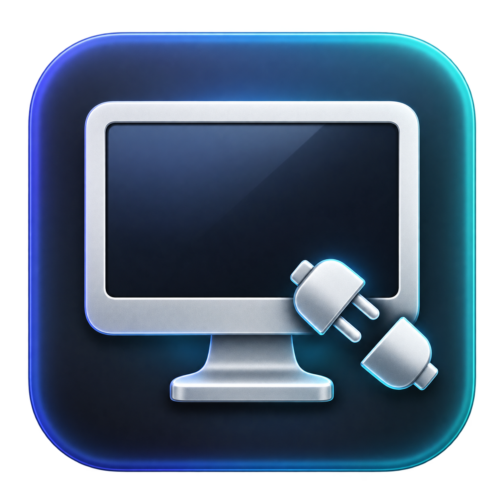
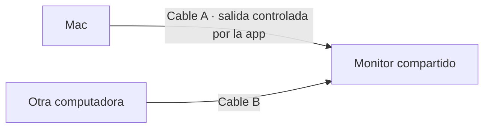
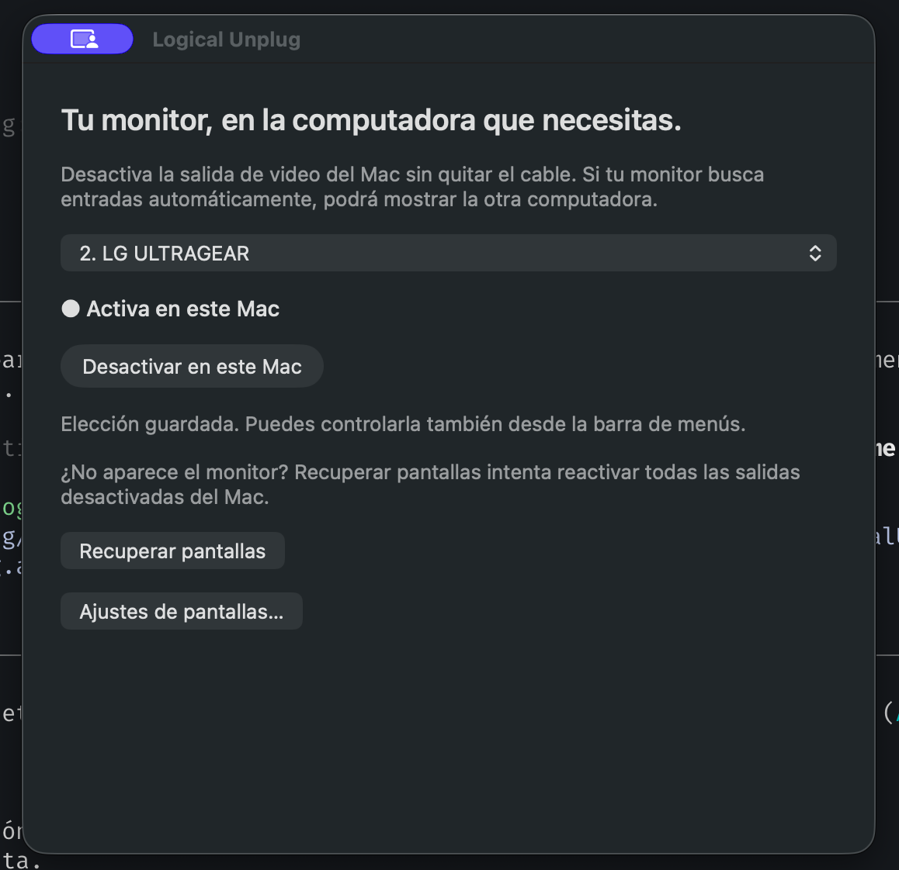

<p align="center"><strong>Español</strong> · <a href="README.en.md">English</a></p>

<p align="center">
  
</p>

<h1 align="center">Logical Unplug</h1>

<p align="center">Un monitor, dos computadoras. Cambia de equipo sin quitar cables.</p>

<p align="center">
  <a href="https://github.com/alexsvt2/logical-monitor-unplug/releases/latest">Descargar para Mac</a> ·
  <a href="#cómo-se-usa">Cómo se usa</a> ·
  <a href="#si-el-monitor-no-aparece">Recuperar pantallas</a>
</p>

Logical Unplug es una app nativa de macOS para **desactivar y reactivar una pantalla externa por software**. Elige el monitor desde la interfaz y contrólalo desde la ventana o la barra de menús. No necesitas editar scripts, buscar identificadores ni instalar herramientas con la terminal.

## El caso de uso

Tienes una pantalla principal para tu Mac y un segundo monitor conectado a **dos computadoras por cables diferentes**. Quieres usar ese segundo monitor con el otro equipo, pero el Mac sigue enviándole video.

1. En Logical Unplug, desactivas el monitor compartido en el Mac.
2. El monitor pierde esa señal. Si tiene búsqueda automática de entrada, puede cambiar al cable de la otra computadora.
3. Cuando quieres volver, reactivas la pantalla desde la app. Según el monitor, puede hacer falta seleccionar la entrada del Mac en su menú.

Los cables permanecen conectados. La app controla la salida de video del Mac; **el cambio de entrada lo realiza el monitor**. No controla el teclado, el ratón ni la otra computadora.



## La app

La interfaz de v0.2.0 está en español. Esta documentación también está disponible en [inglés](README.en.md).

<p align="center">
  
</p>

- **Selección visual:** muestra las pantallas detectadas y recuerda cuál elegiste, sin marcas fijas en el código.
- **Un botón para alternar:** desactiva o reactiva la pantalla seleccionada.
- **Estado actualizado:** consulta macOS cada dos segundos.
- **Barra de menús:** acceso al control aunque cierres la ventana.
- **Recuperación manual:** intenta reactivar las salidas que dejaron de aparecer.
- **Protección de la principal:** impide desactivar la pantalla principal o la integrada.

## Descargar e instalar

La release **v0.2.0** incluye una app para **Mac con Apple Silicon (M1 o posterior)**. Su versión mínima de compilación es macOS 13; la comprobación local se realizó en un Mac M4 con macOS 26. No se ha validado en todas las versiones ni con todos los monitores.

1. Descarga `LogicalUnplug-v0.2.0-macOS-arm64.zip` desde [Releases](https://github.com/alexsvt2/logical-monitor-unplug/releases/latest).
2. Descomprime el archivo y arrastra `LogicalUnplug.app` a **Aplicaciones**.
3. Abre la app. Puedes arrastrarla al Dock para tenerla a mano.

**No necesitas Homebrew, Python ni displayplacer.** La app incluye su propio control nativo de pantallas.

Esta release tiene firma local (*ad hoc*), sin certificado Developer ID ni notarización de Apple. Si macOS bloquea la primera apertura por no poder verificar al desarrollador, consulta [las instrucciones de Apple para abrir una app de un desarrollador desconocido](https://support.apple.com/en-ca/guide/mac-help/mh40616/mac). Esto puede requerir una autorización en **Ajustes del Sistema → Privacidad y seguridad → Abrir igualmente**.

## Cómo se usa

1. Conecta el monitor al Mac y elige la pantalla que quieres compartir en la lista. Si hay una sola pantalla externa secundaria, se preselecciona.
2. Pulsa **Desactivar en este Mac** para dejar de enviarle video.
3. Pulsa **Reactivar en este Mac** cuando quieras volver.

La app recuerda tu elección automáticamente. Al cambiar de monitor, elige el nuevo en la lista. No sustituye silenciosamente una selección guardada que haya desaparecido.

**Activa en este Mac** indica el estado que reporta macOS, no la entrada que está mostrando físicamente el monitor. Detectar una pantalla no la reactiva automáticamente: así no se interrumpe el uso de la otra computadora.

Cerrar la ventana mantiene la app en la barra de menús. **Salir** cierra la app sin cambiar el estado del monitor. Abrirla tampoco apaga pantallas por sí solo.

## Si el monitor no aparece

Pulsa **Recuperar pantallas**. Sirve, por ejemplo, cuando una versión anterior del script dejó la salida desactivada antes de que la app pudiera conocer ese monitor.

La recuperación intenta reactivar **todas** las salidas ocultas compatibles, no solo la elegida. Si no aparece ninguna pantalla adicional, lo indica en lugar de afirmar que funcionó. Selecciona la entrada del Mac en el menú del monitor y vuelve a intentarlo. Si sigue sin detectarse, reconectar el cable puede ser necesario.

Si el botón de desactivar no está disponible, revisa si la pantalla está marcada como principal. **Ajustes de pantallas…** abre la configuración de macOS para cambiar esa asignación.

## Terminal opcional

Para automatizaciones, los mismos controles están disponibles desde el repositorio:

```sh
bin/toggle_monitor.sh             # Alterna la pantalla elegida en la app
bin/toggle_monitor.sh --list      # Lista las pantallas
bin/toggle_monitor.sh --enable    # Reactiva la elegida
bin/toggle_monitor.sh --disable   # Desactiva la elegida
bin/toggle_monitor.sh --recover   # Intenta recuperar todas las salidas ocultas
bin/toggle_monitor.sh --help
```

También puedes invocar el ejecutable dentro de la app con esas opciones. Los comandos de alternar, activar y desactivar admiten un UUID obtenido con `--list`. Los errores devuelven un código distinto de cero y un mensaje descriptivo. No hace falta modificar el código.

## Compilar y contribuir

Necesitas macOS y las herramientas de desarrollo de Apple (Xcode Command Line Tools).

```sh
git clone https://github.com/alexsvt2/logical-monitor-unplug.git
cd logical-monitor-unplug
bash test.sh
bash install.sh
```

`install.sh` compila para la arquitectura de tu Mac, crea `dist/LogicalUnplug.app` y la copia a `~/Applications`. Si ya existe, respalda esa versión antes de actualizarla. `bash build.sh` solo compila y empaqueta. Los scripts requieren las herramientas del sistema; la app resultante no depende de ellas para ejecutarse.

| Archivo | Responsabilidad |
| --- | --- |
| `Sources/MonitorCore.swift` | Detección, selección, recuperación y verificación de cambios |
| `Sources/main.swift` | Interfaz AppKit, barra de menús y CLI |
| `Tests/main.swift` | Selección y protección de pantallas |
| `assets/` | Icono PNG, icono macOS y detalles de su generación |
| `bin/reenable-displays.py` | Auxiliar histórico; no lo ejecuta la app nueva |

La elección se guarda en `~/Library/Application Support/LogicalMonitorUnplug/selection.json`. La interfaz y la CLI comparten un bloqueo para evitar cambios simultáneos.

Las pruebas automáticas cubren selección ambigua, sustitución de monitor, pantalla principal, integrada, única y no detectada; no cambian pantallas reales. La prueba de hardware consiste en desactivar la secundaria, comprobar el cambio a la otra computadora y reactivarla. Debe repetirse con cada combinación de monitor, cables y versión de macOS.

## Compatibilidad y créditos

Desarrollado por [Alexis Lopez](https://github.com/alexsvt2).

- La versión nativa utiliza **AppKit, CoreGraphics y ColorSync** de macOS. Para activar/desactivar la salida resuelve dinámicamente la API privada `CGSConfigureDisplayEnabled`. Puede cambiar en futuras versiones del sistema; la app informa los errores y comprueba el estado después de solicitar un cambio.
- Gracias a **[@alex-konkov](https://github.com/alex-konkov)** por compartir el [mecanismo de recuperación original](https://github.com/jakehilborn/displayplacer/issues/137#issuecomment-1188372337), que dio origen al auxiliar histórico. La recuperación actual conserva su sondeo de identificadores contextuales 1–10 y añade los que conoce macOS; no garantiza encontrar cualquier salida oculta.
- **[displayplacer, de Jake Hilborn](https://github.com/jakehilborn/displayplacer)** fue la herramienta usada por la versión inicial y una referencia técnica. **No es una dependencia de esta app ni se distribuye dentro de ella.**
- Icono generado con OpenAI ImageGen para este proyecto. Captura de pantalla aportada por Alexis Lopez.
